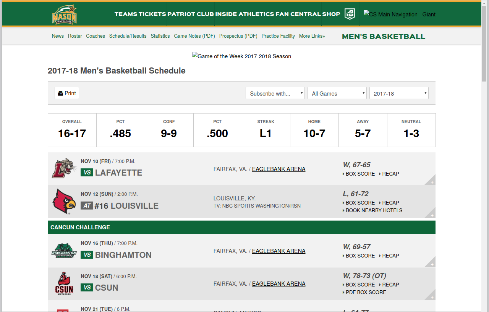
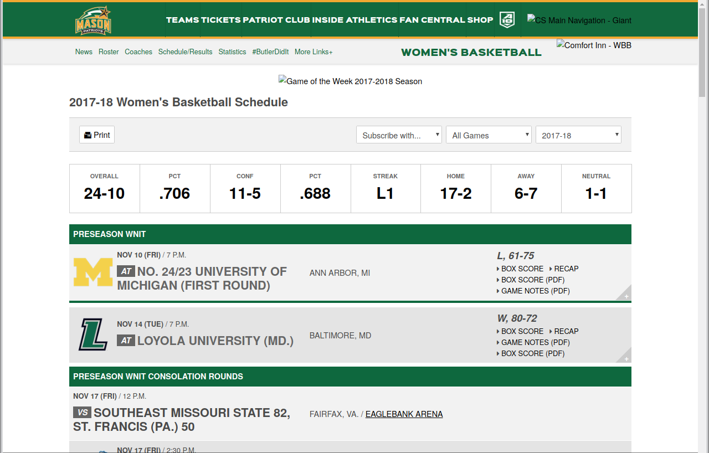

Homework 3
==========

> For your third homework assignment, you will use the [`SelectorGadget` Chrome extension](https://chrome.google.com/webstore/detail/selectorgadget/mhjhnkcfbdhnjickkkdbjoemdmbfginb) and the `rvest` package to scrape data from the [official Mason Patriots sports website](http://gomason.com).

Due: Month Day, Year @ Time

-   [Instructions](#instructions)
-   [Scraping Mason Patriots Scores](#scraping-mason-patriots-scores)
    -   [Men's basketball schedule and scores](#mens-basketball-schedule-and-scores)
    -   [Women's basketball schedule and scores](#womens-basketball-schedule-and-scores)
    -   [Quick data exploration](#quick-data-exploration)
-   [How to submit](#how-to-submit)
-   [Cheatsheets](#cheatsheets)

Instructions
------------

For this homework assignment, you will use the [`SelectorGadget` Chrome extension](https://chrome.google.com/webstore/detail/selectorgadget/mhjhnkcfbdhnjickkkdbjoemdmbfginb) and the `rvest` package to scrape data from the [official Mason Patriots sports website](http://gomason.com).

Use the R Markdown file `homework_3.Rmd` to do your work and write-up when completing the questions below. Remember to fill in your name at the top of the R Markdown document and be sure to save, commit, and push (upload) frequently to Github so that you have incremental snapshots of your work. When you’re done, follow the [How to submit](#how-to-submit) section below to setup a Pull Request, which will be used for feedback.

Scraping Mason Patriots Scores
------------------------------

Webscrapers can be used for all kinds of purposes, such as building movie review databases, tracking prices for goods and services, and analyzing how a news story is reported on different news sites. Collecting sports data is another example, which can be used to [quantify how valuable players are](https://nyti.ms/2FmQhgC) when [putting together a fantasy sports team](https://www.villanovau.com/resources/bi/how-to-use-big-data-in-fantasy-football/). Actual sports teams also employ statistical methods when drafting players and developing strategies, with [Sabermetrics](https://en.wikipedia.org/wiki/Sabermetrics) (depicted in the movie [*Moneyball*](https://www.imdb.com/title/tt1210166/)) being one of the better-known examples.

For this homework assignment, we will scrape the 2017-2018 season schedules and scores for the men's and women's basketball teams on the official [Mason Patriots sports site](http://gomason.com) (<http://gomason.com>). For reference, the 2017-2018 schedule and scores page for the men's team should look like this:

and the 2017-2018 schedule and scores page for the women's team should look like this:

The following questions will guide you through the process of scraping this data.

### Men's basketball schedule and scores

1.  To start, fetch the HTML for the men's basketball schedule page and save the result to disk so that you have an offline copy. After you've saved the HTML in your project folder (you should also stage and commit this file as part of your homework submission), read it into R and assign it to a variable called `mens_bb`.

2.  Mason's opponent for each game is listed on the left side of each row, just after a small box that says *VS* or *AT*. Use the SelectorGadget tool to determine the CSS selector needed to scrape this information, and then write the code that scrapes this information. Assign the scraped data to a variable called `mens_opponents`. If done right, `mens_opponents` should be a character vector containing 33 teams.

3.  The location for each game is listed to the right of the opponent's name. For games played in the United States it lists the city and state, for example "Fairfax, VA" is the location for home games. Use the SelectorGadget tool to determine the CSS selector needed to scrape this information, and then write the code that scrapes this information. Assign the scraped data to a variable called `mens_locations`.

4.  The date for each game is listed above the opponent's name, and has the format *Month Day (Day of the Week)*. For example, the first listed game has the date *Nov 10 (FRI)*. Use the SelectorGadget tool to determine the CSS selector needed to scrape this information, and then write the code that scrapes this information. Assign the scraped data to a variable called `mens_dates`.

5.  The time for each game is listed to the right of the game date. For example, the first listed game has the time *7:00 P.M.* Use the SelectorGadget tool to determine the CSS selector needed to scrape this information, and then write the code that scrapes this information. Assign the scraped data to a variable called `mens_times`.

6.  The score for each game is listed on the right side of each row in the format *Mason's score-Opponent's score*. For example, the first listed game has the score *67-65*. Use the SelectorGadget tool to determine the CSS selector needed to scrape this information, and then write the code that scrapes this information. Assign the scraped data to a variable called `mens_scores`. Your `mens_scores` vector should only have 33 pieces of data in it, if it has more or less then you need to try another CSS selector.

7.  The **W** or **L** to the left of each game score indicates whether Mason won (**W**) or lost (**L**) the game. Use the SelectorGadget tool to determine the CSS selector needed to scrape this information, and then write the code that scrapes this information. You'll note that for each game you'll actually get `W,` or `L,`. Pipe (`%>%`) your scraped data into the `str_remove()` function and tell it to get rid of the comma. Assign the scraped data to a variable called `mens_win_loss`.

8.  Use the `data_frame()` function to store your scraped data as a data frame and assign it to a variable called `mens_df`. Your data frame should have 33 rows with columns in the following order:

    -   `date`
    -   `time`
    -   `opponent`
    -   `location`
    -   `score`
    -   `win_loss`

### Women's basketball schedule and scores

1.  The code you created for scraping the men's basketball team schedule and scores can be used as a starting point for scraping the women's team schedule. Copy the code you wrote in the blocks for the men's page and paste it here. **Change the prefix of the variable names you assign each output into from `mens_` to `womens_`, and the code so that it loads the women's schedule and scores page**. Fix the code where necessary until you've scraped all the women's scores, then use `data_frame()` to store your scraped data in a data frame and assign it to a variable called `womens_df`. Your data frame should have 34 rows with columns in the following order:

    -   `date`
    -   `time`
    -   `opponent`
    -   `location`
    -   `score`
    -   `win_loss`

Quick data exploration
----------------------

Collecting data doesn't serve much of a purpose if we don't explore or analyze it. Create the summary reports and visualizations requested below to help you better understand the data you just collected.

1.  What was the average score for the men's team (Mason only) when they won a game and when they lost a game? What was the average score for the women's team (Mason only) when they won a game and when they lost a game?

    **Hint: To answer this, you will need to use the `separate()` function.**

2.  Plot the men's histogram of scores and the women's histogram of scores (just for the Mason teams, not the opponents), and then compare the two histograms. Which histogram is centered at a higher score? Which histogram has the larger spread? Are there any other notable differences?

How to submit
-------------

When you are ready to submit, be sure to save, commit, and push your final result so that everything is synchronized to Github. Then, navigate to **your copy** of the Github repository you used for this assignment. You should see your repository, along with the updated files that you just synchronized to Github. Confirm that your files are up-to-date, and then do the following steps:

1.  Click the *Pull Requests* tab near the top of the page.
2.  Click the green button that says "New pull request".
3.  Click the dropdown menu button labeled "base:", and select the option `grading`.
4.  Confirm that the dropdown menu button labeled "compare:" is set to `master`.
5.  Click the green button that says "Create pull request".
6.  Give the *pull request* the following title: `Submission: Homework 3, FirstName LastName`, replacing `FirstName` and `LastName` with your actual first and last name.
7.  In the messagebox, write: `My homework submission is ready for grading @instructor-username`.
8.  Click "Create pull request" to lock in your submission.

Cheatsheets
-----------

You are encouraged to review and keep the following cheatsheets handy while working on this assignment:

-   [RStudio cheatsheet](http://summer18.cds101.com/doc/rstudio-IDE-cheatsheet.pdf)
-   [RMarkdown cheatsheet](http://summer18.cds101.com/doc/rmarkdown-cheatsheet.pdf)
-   [RMarkdown reference](http://summer18.cds101.com/doc/rmarkdown-reference.pdf)
-   [`ggplot2` cheatsheet](http://summer18.cds101.com/doc/ggplot2-cheatsheet.pdf)
-   [Data transformation cheatsheet](http://summer18.cds101.com/doc/data-transformation-cheatsheet.pdf)
-   [Data import cheatsheet](http://summer18.cds101.com/doc/data-import-cheatsheet.pdf)
